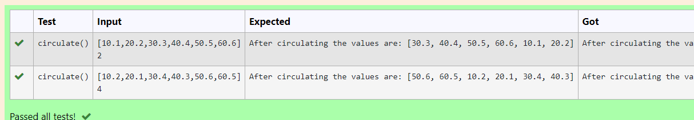

# Circulate-the-values-of-N-variables
## Aim:
To write a python program to circulate the n variables using function concept
## Equipment’s required:
PC
Anaconda - Python 3.7
## Algorithm: 
### Step 1: 
first step is to define the function
### Step 2: 
get a,n inputs from the user
### Step 3: 
Get the value from the user for the number of rotation
### Step 4: 
Using the slicing concept rotate the list
### Step 5:
finally print the result

## Program:
```
#Program to circulate N values.
#Developed by: SREEVALSAN V
#RegisterNumber: 23012962
def circulate():
    li=eval(input())
    n=eval(input())
    li=li[n:]+li[:n]
    print("After circulating the values are:",li)
```

## Output:


## Result:
By this program we able to circulate the values of n - variables
